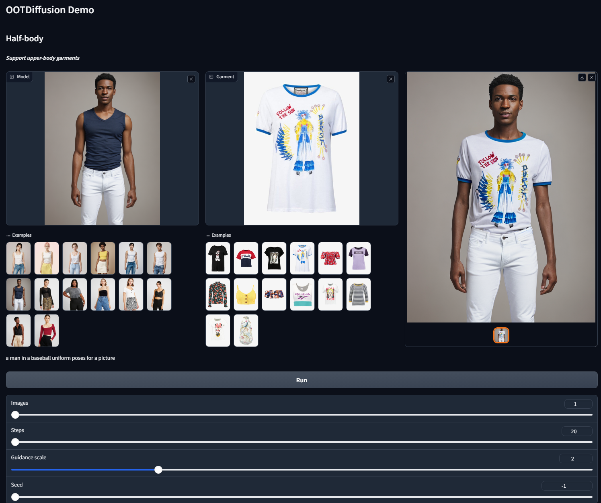

# Fashion Diffusion

Un projet d'apprentissage automatique pour prédire la popularité des articles de mode sur la base de leurs images et de leurs métadonnées.

## Introduction

Fashion Diffusion est un projet d'apprentissage automatique qui utilise des techniques de traitement d'image et de modélisation prédictive pour prédire la popularité des articles de mode sur la base de leurs images et de leurs métadonnées. Le projet utilise des données provenant de plusieurs sources, notamment des images de produits, des descriptions de produits et des évaluations de clients.

## Modèles

Le projet utilise plusieurs modèles pour prédire la popularité des articles de mode, notamment :

- **Modèle de régression linéaire (Linear Regression Model)** : utilise les métadonnées des produits pour prédire leur popularité.
- **Modèle de réseau neuronal convolutif (Convolutional Neural Network Model, CNN)** : utilise les images des produits pour prédire leur popularité. Le modèle CNN utilisé dans ce projet est le `clip-vit-large-patch14`.
- **Modèle d'apprentissage en profondeur (Deep Learning Model)** : combine les métadonnées et les images des produits pour prédire leur popularité. Le modèle d'apprentissage en profondeur utilise une architecture de réseau neuronal à plusieurs couches pour extraire les caractéristiques des images et des métadonnées des produits. Le modèle utilise également `ViTImageProcessor` et `AutoTokenizer` pour prétraiter les images et les métadonnées en entrées pour le modèle.

En plus des modèles ci-dessus, le projet utilise également les outils suivants pour le traitement d'image et la génération de descriptions de produits :

- `humanparsing` : un modèle de segmentation sémantique pour identifier les différentes parties du corps humain dans les images de produits.
- `ootd` : un modèle de détection d'objets pour identifier les différents articles de mode dans les images de produits.
- `openpose` : un modèle de pose estimation pour identifier la pose du mannequin dans les images de produits.
- `VisionEncoderDecoderModel` : un modèle de génération de texte à partir d'images pour générer des descriptions de produits à partir des images de produits.

# Utilisation
Pour utiliser le projet, vous devez d'abord cloner le dépôt GitHub et installer les dépendances nécessaires en utilisant pip :

```
git clone https://github.com/nat997/fashion_diffusion.git
```

```sh
conda create -n ootd python==3.10
conda activate ootd
pip install torch==2.0.1 torchvision==0.15.2 torchaudio==2.0.2
pip install -r requirements.txt
```

Ensuite, vous pouvez utiliser les scripts fournis dans le répertoire "scripts" pour télécharger les données, entraîner les modèles et évaluer leurs performances. Par exemple, pour entraîner le modèle d'apprentissage en profondeur, vous pouvez utiliser le script "train_deep_model.py" :

```
python scripts/train_deep_model.py --data_dir data/ --model_dir models/
```
Le script entraînera le modèle sur les données spécifiées et enregistrera les paramètres du modèle dans le répertoire spécifié. Vous pouvez ensuite utiliser le script "evaluate_deep_model.py" pour évaluer les performances du modèle sur un ensemble de données de test :

```
python scripts/evaluate_deep_model.py --data_dir data/ --model_dir models/
```
Le script calculera les métriques d'évaluation appropriées et les affichera à l'écran.

Télécharger [clip-vit-large-patch14](https://huggingface.co/openai/clip-vit-large-patch14) into ***checkpoints*** folder

Pour lancer le projet :
```
cd run
python gradio_ootd.py
```
## Demonstration


## Diagram function of the code


<?xml version="1.0" encoding="UTF-8"?>
<!-- Do not edit this file with editors other than draw.io -->
<!DOCTYPE svg PUBLIC "-//W3C//DTD SVG 1.1//EN" "http://www.w3.org/Graphics/SVG/1.1/DTD/svg11.dtd">
<svg xmlns="http://www.w3.org/2000/svg" xmlns:xlink="http://www.w3.org/1999/xlink" version="1.1" width="1039px" height="896px" viewBox="-0.5 -0.5 1039 896" content="&lt;mxfile host=&quot;app.diagrams.net&quot; modified=&quot;2024-03-22T09:02:36.776Z&quot; agent=&quot;Mozilla/5.0 (Macintosh; Intel Mac OS X 10_15_7) AppleWebKit/537.36 (KHTML, like Gecko) Chrome/120.0.0.0 Safari/537.36&quot; etag=&quot;vq1UhhQPRBeLud7ujLHl&quot; version=&quot;23.1.1&quot; type=&quot;device&quot;&gt;&#10;  &lt;diagram name=&quot;Page-1&quot; id=&quot;P3hZV1RTRPBwDaxr1NtK&quot;&gt;&#10;    &lt;mxGraphModel dx=&quot;1314&quot; dy=&quot;751&quot; grid=&quot;1&quot; gridSize=&quot;10&quot; guides=&quot;1&quot; tooltips=&quot;1&quot; connect=&quot;1&quot; arrows=&quot;1&quot; fold=&quot;1&quot; page=&quot;1&quot; pageScale=&quot;1&quot; pageWidth=&quot;850&quot; pageHeight=&quot;1100&quot; background=&quot;#FFFFFF&quot; math=&quot;0&quot; shadow=&quot;0&quot;&gt;&#10;      &lt;root&gt;&#10;        &lt;mxCell id=&quot;0&quot; /&gt;&#10;        &lt;mxCell id=&quot;1&quot; parent=&quot;0&quot; /&gt;&#10;        &lt;mxCell id=&quot;dRuPuyQcN3BoXz86JJPz-1&quot; value=&quot;User Input&quot; style=&quot;whiteSpace=wrap;strokeWidth=2;&quot; vertex=&quot;1&quot; parent=&quot;1&quot;&gt;&#10;          &lt;mxGeometry x=&quot;458&quot; y=&quot;20&quot; width=&quot;89&quot; height=&quot;34&quot; as=&quot;geometry&quot; /&gt;&#10;        &lt;/mxCell&gt;&#10;        &lt;mxCell id=&quot;dRuPuyQcN3BoXz86JJPz-2&quot; value=&quot;Gradio App&quot; style=&quot;whiteSpace=wrap;strokeWidth=2;&quot; vertex=&quot;1&quot; parent=&quot;1&quot;&gt;&#10;          &lt;mxGeometry x=&quot;456&quot; y=&quot;104&quot; width=&quot;94&quot; height=&quot;34&quot; as=&quot;geometry&quot; /&gt;&#10;        &lt;/mxCell&gt;&#10;        &lt;mxCell id=&quot;dRuPuyQcN3BoXz86JJPz-3&quot; value=&quot;Image Prep&quot; style=&quot;whiteSpace=wrap;strokeWidth=2;&quot; vertex=&quot;1&quot; parent=&quot;1&quot;&gt;&#10;          &lt;mxGeometry x=&quot;455&quot; y=&quot;187&quot; width=&quot;95&quot; height=&quot;34&quot; as=&quot;geometry&quot; /&gt;&#10;        &lt;/mxCell&gt;&#10;        &lt;mxCell id=&quot;dRuPuyQcN3BoXz86JJPz-4&quot; value=&quot;Human Parsing Model&quot; style=&quot;whiteSpace=wrap;strokeWidth=2;&quot; vertex=&quot;1&quot; parent=&quot;1&quot;&gt;&#10;          &lt;mxGeometry x=&quot;30&quot; y=&quot;289&quot; width=&quot;167&quot; height=&quot;34&quot; as=&quot;geometry&quot; /&gt;&#10;        &lt;/mxCell&gt;&#10;        &lt;mxCell id=&quot;dRuPuyQcN3BoXz86JJPz-5&quot; value=&quot;OOTD Detection Model&quot; style=&quot;whiteSpace=wrap;strokeWidth=2;&quot; vertex=&quot;1&quot; parent=&quot;1&quot;&gt;&#10;          &lt;mxGeometry x=&quot;272&quot; y=&quot;289&quot; width=&quot;177&quot; height=&quot;34&quot; as=&quot;geometry&quot; /&gt;&#10;        &lt;/mxCell&gt;&#10;        &lt;mxCell id=&quot;dRuPuyQcN3BoXz86JJPz-6&quot; value=&quot;OpenPose Model&quot; style=&quot;whiteSpace=wrap;strokeWidth=2;&quot; vertex=&quot;1&quot; parent=&quot;1&quot;&gt;&#10;          &lt;mxGeometry x=&quot;579&quot; y=&quot;289&quot; width=&quot;131&quot; height=&quot;34&quot; as=&quot;geometry&quot; /&gt;&#10;        &lt;/mxCell&gt;&#10;        &lt;mxCell id=&quot;dRuPuyQcN3BoXz86JJPz-7&quot; value=&quot;ViT Image Processor&quot; style=&quot;whiteSpace=wrap;strokeWidth=2;&quot; vertex=&quot;1&quot; parent=&quot;1&quot;&gt;&#10;          &lt;mxGeometry x=&quot;859&quot; y=&quot;289&quot; width=&quot;158&quot; height=&quot;34&quot; as=&quot;geometry&quot; /&gt;&#10;        &lt;/mxCell&gt;&#10;        &lt;mxCell id=&quot;dRuPuyQcN3BoXz86JJPz-8&quot; value=&quot;Parse Human Body Parts&quot; style=&quot;whiteSpace=wrap;strokeWidth=2;&quot; vertex=&quot;1&quot; parent=&quot;1&quot;&gt;&#10;          &lt;mxGeometry x=&quot;20&quot; y=&quot;373&quot; width=&quot;187&quot; height=&quot;34&quot; as=&quot;geometry&quot; /&gt;&#10;        &lt;/mxCell&gt;&#10;        &lt;mxCell id=&quot;dRuPuyQcN3BoXz86JJPz-9&quot; value=&quot;Detect Clothing Items&quot; style=&quot;whiteSpace=wrap;strokeWidth=2;&quot; vertex=&quot;1&quot; parent=&quot;1&quot;&gt;&#10;          &lt;mxGeometry x=&quot;275&quot; y=&quot;373&quot; width=&quot;171&quot; height=&quot;34&quot; as=&quot;geometry&quot; /&gt;&#10;        &lt;/mxCell&gt;&#10;        &lt;mxCell id=&quot;dRuPuyQcN3BoXz86JJPz-10&quot; value=&quot;Estimate Pose&quot; style=&quot;whiteSpace=wrap;strokeWidth=2;&quot; vertex=&quot;1&quot; parent=&quot;1&quot;&gt;&#10;          &lt;mxGeometry x=&quot;588&quot; y=&quot;373&quot; width=&quot;114&quot; height=&quot;34&quot; as=&quot;geometry&quot; /&gt;&#10;        &lt;/mxCell&gt;&#10;        &lt;mxCell id=&quot;dRuPuyQcN3BoXz86JJPz-11&quot; value=&quot;Process Image for ViT Model&quot; style=&quot;whiteSpace=wrap;strokeWidth=2;&quot; vertex=&quot;1&quot; parent=&quot;1&quot;&gt;&#10;          &lt;mxGeometry x=&quot;830&quot; y=&quot;373&quot; width=&quot;215&quot; height=&quot;34&quot; as=&quot;geometry&quot; /&gt;&#10;        &lt;/mxCell&gt;&#10;        &lt;mxCell id=&quot;dRuPuyQcN3BoXz86JJPz-12&quot; value=&quot;Human Body Features&quot; style=&quot;whiteSpace=wrap;strokeWidth=2;&quot; vertex=&quot;1&quot; parent=&quot;1&quot;&gt;&#10;          &lt;mxGeometry x=&quot;28&quot; y=&quot;456&quot; width=&quot;171&quot; height=&quot;34&quot; as=&quot;geometry&quot; /&gt;&#10;        &lt;/mxCell&gt;&#10;        &lt;mxCell id=&quot;dRuPuyQcN3BoXz86JJPz-13&quot; value=&quot;Clothing Items (OOTD Model)&quot; style=&quot;whiteSpace=wrap;strokeWidth=2;&quot; vertex=&quot;1&quot; parent=&quot;1&quot;&gt;&#10;          &lt;mxGeometry x=&quot;249&quot; y=&quot;456&quot; width=&quot;223&quot; height=&quot;34&quot; as=&quot;geometry&quot; /&gt;&#10;        &lt;/mxCell&gt;&#10;        &lt;mxCell id=&quot;dRuPuyQcN3BoXz86JJPz-14&quot; value=&quot;Pose Features (OpenPose Model)&quot; style=&quot;whiteSpace=wrap;strokeWidth=2;&quot; vertex=&quot;1&quot; parent=&quot;1&quot;&gt;&#10;          &lt;mxGeometry x=&quot;522&quot; y=&quot;456&quot; width=&quot;247&quot; height=&quot;34&quot; as=&quot;geometry&quot; /&gt;&#10;        &lt;/mxCell&gt;&#10;        &lt;mxCell id=&quot;dRuPuyQcN3BoXz86JJPz-15&quot; value=&quot;ViT Features (ViT Image Model)&quot; style=&quot;whiteSpace=wrap;strokeWidth=2;&quot; vertex=&quot;1&quot; parent=&quot;1&quot;&gt;&#10;          &lt;mxGeometry x=&quot;818&quot; y=&quot;456&quot; width=&quot;239&quot; height=&quot;34&quot; as=&quot;geometry&quot; /&gt;&#10;        &lt;/mxCell&gt;&#10;        &lt;mxCell id=&quot;dRuPuyQcN3BoXz86JJPz-16&quot; value=&quot;Concatenate Features&quot; style=&quot;whiteSpace=wrap;strokeWidth=2;&quot; vertex=&quot;1&quot; parent=&quot;1&quot;&gt;&#10;          &lt;mxGeometry x=&quot;416&quot; y=&quot;540&quot; width=&quot;172&quot; height=&quot;34&quot; as=&quot;geometry&quot; /&gt;&#10;        &lt;/mxCell&gt;&#10;        &lt;mxCell id=&quot;dRuPuyQcN3BoXz86JJPz-17&quot; value=&quot;Fashion Diffusion Model (Deep Learning Model)&quot; style=&quot;whiteSpace=wrap;strokeWidth=2;&quot; vertex=&quot;1&quot; parent=&quot;1&quot;&gt;&#10;          &lt;mxGeometry x=&quot;327&quot; y=&quot;623&quot; width=&quot;350&quot; height=&quot;34&quot; as=&quot;geometry&quot; /&gt;&#10;        &lt;/mxCell&gt;&#10;        &lt;mxCell id=&quot;dRuPuyQcN3BoXz86JJPz-18&quot; value=&quot;Generate Outfit Recommendations&quot; style=&quot;whiteSpace=wrap;strokeWidth=2;&quot; vertex=&quot;1&quot; parent=&quot;1&quot;&gt;&#10;          &lt;mxGeometry x=&quot;371&quot; y=&quot;707&quot; width=&quot;264&quot; height=&quot;34&quot; as=&quot;geometry&quot; /&gt;&#10;        &lt;/mxCell&gt;&#10;        &lt;mxCell id=&quot;dRuPuyQcN3BoXz86JJPz-19&quot; value=&quot;Display Outfit Recommendations in Gradio App&quot; style=&quot;whiteSpace=wrap;strokeWidth=2;&quot; vertex=&quot;1&quot; parent=&quot;1&quot;&gt;&#10;          &lt;mxGeometry x=&quot;330&quot; y=&quot;800&quot; width=&quot;350&quot; height=&quot;34&quot; as=&quot;geometry&quot; /&gt;&#10;        &lt;/mxCell&gt;&#10;        &lt;mxCell id=&quot;dRuPuyQcN3BoXz86JJPz-20&quot; value=&quot;&quot; style=&quot;curved=1;startArrow=none;endArrow=block;exitX=0.5020847963483146;exitY=0.9852941176470589;entryX=0.4966547539893617;entryY=-0.014705882352941176;rounded=0;&quot; edge=&quot;1&quot; parent=&quot;1&quot; source=&quot;dRuPuyQcN3BoXz86JJPz-1&quot; target=&quot;dRuPuyQcN3BoXz86JJPz-2&quot;&gt;&#10;          &lt;mxGeometry relative=&quot;1&quot; as=&quot;geometry&quot;&gt;&#10;            &lt;Array as=&quot;points&quot; /&gt;&#10;          &lt;/mxGeometry&gt;&#10;        &lt;/mxCell&gt;&#10;        &lt;mxCell id=&quot;dRuPuyQcN3BoXz86JJPz-21&quot; value=&quot;&quot; style=&quot;curved=1;startArrow=none;endArrow=block;exitX=0.4966547539893617;exitY=0.9705882352941176;entryX=0.501953125;entryY=0;rounded=0;&quot; edge=&quot;1&quot; parent=&quot;1&quot; source=&quot;dRuPuyQcN3BoXz86JJPz-2&quot; target=&quot;dRuPuyQcN3BoXz86JJPz-3&quot;&gt;&#10;          &lt;mxGeometry relative=&quot;1&quot; as=&quot;geometry&quot;&gt;&#10;            &lt;Array as=&quot;points&quot; /&gt;&#10;          &lt;/mxGeometry&gt;&#10;        &lt;/mxCell&gt;&#10;        &lt;mxCell id=&quot;dRuPuyQcN3BoXz86JJPz-22&quot; value=&quot;processes through&quot; style=&quot;curved=1;startArrow=none;endArrow=block;exitX=0.0032689144736842107;exitY=0.6752784079282923;entryX=0.5004912050898204;entryY=0;rounded=0;&quot; edge=&quot;1&quot; parent=&quot;1&quot; source=&quot;dRuPuyQcN3BoXz86JJPz-3&quot; target=&quot;dRuPuyQcN3BoXz86JJPz-4&quot;&gt;&#10;          &lt;mxGeometry relative=&quot;1&quot; as=&quot;geometry&quot;&gt;&#10;            &lt;Array as=&quot;points&quot;&gt;&#10;              &lt;mxPoint x=&quot;114&quot; y=&quot;255&quot; /&gt;&#10;            &lt;/Array&gt;&#10;          &lt;/mxGeometry&gt;&#10;        &lt;/mxCell&gt;&#10;        &lt;mxCell id=&quot;dRuPuyQcN3BoXz86JJPz-23&quot; value=&quot;processes through&quot; style=&quot;curved=1;startArrow=none;endArrow=block;exitX=0.009839497065273631;exitY=0.9852941176470589;entryX=0.4990951624293785;entryY=0;rounded=0;&quot; edge=&quot;1&quot; parent=&quot;1&quot; source=&quot;dRuPuyQcN3BoXz86JJPz-3&quot; target=&quot;dRuPuyQcN3BoXz86JJPz-5&quot;&gt;&#10;          &lt;mxGeometry relative=&quot;1&quot; as=&quot;geometry&quot;&gt;&#10;            &lt;Array as=&quot;points&quot;&gt;&#10;              &lt;mxPoint x=&quot;360&quot; y=&quot;255&quot; /&gt;&#10;            &lt;/Array&gt;&#10;          &lt;/mxGeometry&gt;&#10;        &lt;/mxCell&gt;&#10;        &lt;mxCell id=&quot;dRuPuyQcN3BoXz86JJPz-24&quot; value=&quot;processes through&quot; style=&quot;curved=1;startArrow=none;endArrow=block;exitX=0.994066752934727;exitY=0.9852941176470589;entryX=0.5040553435114504;entryY=0;rounded=0;&quot; edge=&quot;1&quot; parent=&quot;1&quot; source=&quot;dRuPuyQcN3BoXz86JJPz-3&quot; target=&quot;dRuPuyQcN3BoXz86JJPz-6&quot;&gt;&#10;          &lt;mxGeometry relative=&quot;1&quot; as=&quot;geometry&quot;&gt;&#10;            &lt;Array as=&quot;points&quot;&gt;&#10;              &lt;mxPoint x=&quot;645&quot; y=&quot;255&quot; /&gt;&#10;            &lt;/Array&gt;&#10;          &lt;/mxGeometry&gt;&#10;        &lt;/mxCell&gt;&#10;        &lt;mxCell id=&quot;dRuPuyQcN3BoXz86JJPz-25&quot; value=&quot;processes through&quot; style=&quot;curved=1;startArrow=none;endArrow=block;exitX=1.0006373355263158;exitY=0.6560215980080035;entryX=0.4977996439873418;entryY=0;rounded=0;&quot; edge=&quot;1&quot; parent=&quot;1&quot; source=&quot;dRuPuyQcN3BoXz86JJPz-3&quot; target=&quot;dRuPuyQcN3BoXz86JJPz-7&quot;&gt;&#10;          &lt;mxGeometry relative=&quot;1&quot; as=&quot;geometry&quot;&gt;&#10;            &lt;Array as=&quot;points&quot;&gt;&#10;              &lt;mxPoint x=&quot;938&quot; y=&quot;255&quot; /&gt;&#10;            &lt;/Array&gt;&#10;          &lt;/mxGeometry&gt;&#10;        &lt;/mxCell&gt;&#10;        &lt;mxCell id=&quot;dRuPuyQcN3BoXz86JJPz-26&quot; value=&quot;&quot; style=&quot;curved=1;startArrow=none;endArrow=block;exitX=0.5004912050898204;exitY=0.9852941176470589;entryX=0.5004386697860963;entryY=-0.014705882352941176;rounded=0;&quot; edge=&quot;1&quot; parent=&quot;1&quot; source=&quot;dRuPuyQcN3BoXz86JJPz-4&quot; target=&quot;dRuPuyQcN3BoXz86JJPz-8&quot;&gt;&#10;          &lt;mxGeometry relative=&quot;1&quot; as=&quot;geometry&quot;&gt;&#10;            &lt;Array as=&quot;points&quot; /&gt;&#10;          &lt;/mxGeometry&gt;&#10;        &lt;/mxCell&gt;&#10;        &lt;mxCell id=&quot;dRuPuyQcN3BoXz86JJPz-27&quot; value=&quot;&quot; style=&quot;curved=1;startArrow=none;endArrow=block;exitX=0.4990951624293785;exitY=0.9852941176470589;entryX=0.49906341374269003;entryY=-0.014705882352941176;rounded=0;&quot; edge=&quot;1&quot; parent=&quot;1&quot; source=&quot;dRuPuyQcN3BoXz86JJPz-5&quot; target=&quot;dRuPuyQcN3BoXz86JJPz-9&quot;&gt;&#10;          &lt;mxGeometry relative=&quot;1&quot; as=&quot;geometry&quot;&gt;&#10;            &lt;Array as=&quot;points&quot; /&gt;&#10;          &lt;/mxGeometry&gt;&#10;        &lt;/mxCell&gt;&#10;        &lt;mxCell id=&quot;dRuPuyQcN3BoXz86JJPz-28&quot; value=&quot;&quot; style=&quot;curved=1;startArrow=none;endArrow=block;exitX=0.5040553435114504;exitY=0.9852941176470589;entryX=0.5002741228070176;entryY=-0.014705882352941176;rounded=0;&quot; edge=&quot;1&quot; parent=&quot;1&quot; source=&quot;dRuPuyQcN3BoXz86JJPz-6&quot; target=&quot;dRuPuyQcN3BoXz86JJPz-10&quot;&gt;&#10;          &lt;mxGeometry relative=&quot;1&quot; as=&quot;geometry&quot;&gt;&#10;            &lt;Array as=&quot;points&quot; /&gt;&#10;          &lt;/mxGeometry&gt;&#10;        &lt;/mxCell&gt;&#10;        &lt;mxCell id=&quot;dRuPuyQcN3BoXz86JJPz-29&quot; value=&quot;&quot; style=&quot;curved=1;startArrow=none;endArrow=block;exitX=0.4977996439873418;exitY=0.9852941176470589;entryX=0.5007085755813954;entryY=-0.014705882352941176;rounded=0;&quot; edge=&quot;1&quot; parent=&quot;1&quot; source=&quot;dRuPuyQcN3BoXz86JJPz-7&quot; target=&quot;dRuPuyQcN3BoXz86JJPz-11&quot;&gt;&#10;          &lt;mxGeometry relative=&quot;1&quot; as=&quot;geometry&quot;&gt;&#10;            &lt;Array as=&quot;points&quot; /&gt;&#10;          &lt;/mxGeometry&gt;&#10;        &lt;/mxCell&gt;&#10;        &lt;mxCell id=&quot;dRuPuyQcN3BoXz86JJPz-30&quot; value=&quot;&quot; style=&quot;curved=1;startArrow=none;endArrow=block;exitX=0.5004386697860963;exitY=0.9705882352941176;entryX=0.5004797149122807;entryY=0;rounded=0;&quot; edge=&quot;1&quot; parent=&quot;1&quot; source=&quot;dRuPuyQcN3BoXz86JJPz-8&quot; target=&quot;dRuPuyQcN3BoXz86JJPz-12&quot;&gt;&#10;          &lt;mxGeometry relative=&quot;1&quot; as=&quot;geometry&quot;&gt;&#10;            &lt;Array as=&quot;points&quot; /&gt;&#10;          &lt;/mxGeometry&gt;&#10;        &lt;/mxCell&gt;&#10;        &lt;mxCell id=&quot;dRuPuyQcN3BoXz86JJPz-31&quot; value=&quot;&quot; style=&quot;curved=1;startArrow=none;endArrow=block;exitX=0.49906341374269003;exitY=0.9705882352941176;entryX=0.4992818105381166;entryY=0;rounded=0;&quot; edge=&quot;1&quot; parent=&quot;1&quot; source=&quot;dRuPuyQcN3BoXz86JJPz-9&quot; target=&quot;dRuPuyQcN3BoXz86JJPz-13&quot;&gt;&#10;          &lt;mxGeometry relative=&quot;1&quot; as=&quot;geometry&quot;&gt;&#10;            &lt;Array as=&quot;points&quot; /&gt;&#10;          &lt;/mxGeometry&gt;&#10;        &lt;/mxCell&gt;&#10;        &lt;mxCell id=&quot;dRuPuyQcN3BoXz86JJPz-32&quot; value=&quot;&quot; style=&quot;curved=1;startArrow=none;endArrow=block;exitX=0.5002741228070176;exitY=0.9705882352941176;entryX=0.4981022267206478;entryY=0;rounded=0;&quot; edge=&quot;1&quot; parent=&quot;1&quot; source=&quot;dRuPuyQcN3BoXz86JJPz-10&quot; target=&quot;dRuPuyQcN3BoXz86JJPz-14&quot;&gt;&#10;          &lt;mxGeometry relative=&quot;1&quot; as=&quot;geometry&quot;&gt;&#10;            &lt;Array as=&quot;points&quot; /&gt;&#10;          &lt;/mxGeometry&gt;&#10;        &lt;/mxCell&gt;&#10;        &lt;mxCell id=&quot;dRuPuyQcN3BoXz86JJPz-33&quot; value=&quot;&quot; style=&quot;curved=1;startArrow=none;endArrow=block;exitX=0.5007085755813954;exitY=0.9705882352941176;entryX=0.5006374215481172;entryY=0;rounded=0;&quot; edge=&quot;1&quot; parent=&quot;1&quot; source=&quot;dRuPuyQcN3BoXz86JJPz-11&quot; target=&quot;dRuPuyQcN3BoXz86JJPz-15&quot;&gt;&#10;          &lt;mxGeometry relative=&quot;1&quot; as=&quot;geometry&quot;&gt;&#10;            &lt;Array as=&quot;points&quot; /&gt;&#10;          &lt;/mxGeometry&gt;&#10;        &lt;/mxCell&gt;&#10;        &lt;mxCell id=&quot;dRuPuyQcN3BoXz86JJPz-34&quot; value=&quot;&quot; style=&quot;curved=1;startArrow=none;endArrow=block;exitX=0.5004797149122807;exitY=0.9852941176470589;entryX=0.0028956213662790697;entryY=0.20594882508547296;rounded=0;&quot; edge=&quot;1&quot; parent=&quot;1&quot; source=&quot;dRuPuyQcN3BoXz86JJPz-12&quot; target=&quot;dRuPuyQcN3BoXz86JJPz-16&quot;&gt;&#10;          &lt;mxGeometry relative=&quot;1&quot; as=&quot;geometry&quot;&gt;&#10;            &lt;Array as=&quot;points&quot;&gt;&#10;              &lt;mxPoint x=&quot;114&quot; y=&quot;515&quot; /&gt;&#10;            &lt;/Array&gt;&#10;          &lt;/mxGeometry&gt;&#10;        &lt;/mxCell&gt;&#10;        &lt;mxCell id=&quot;dRuPuyQcN3BoXz86JJPz-35&quot; value=&quot;&quot; style=&quot;curved=1;startArrow=none;endArrow=block;exitX=0.4992818105381166;exitY=0.9852941176470589;entryX=0.17195809144791818;entryY=-0.014705882352941176;rounded=0;&quot; edge=&quot;1&quot; parent=&quot;1&quot; source=&quot;dRuPuyQcN3BoXz86JJPz-13&quot; target=&quot;dRuPuyQcN3BoXz86JJPz-16&quot;&gt;&#10;          &lt;mxGeometry relative=&quot;1&quot; as=&quot;geometry&quot;&gt;&#10;            &lt;Array as=&quot;points&quot;&gt;&#10;              &lt;mxPoint x=&quot;360&quot; y=&quot;515&quot; /&gt;&#10;            &lt;/Array&gt;&#10;          &lt;/mxGeometry&gt;&#10;        &lt;/mxCell&gt;&#10;        &lt;mxCell id=&quot;dRuPuyQcN3BoXz86JJPz-36&quot; value=&quot;&quot; style=&quot;curved=1;startArrow=none;endArrow=block;exitX=0.4981022267206478;exitY=0.9852941176470589;entryX=0.8360133838427795;entryY=-0.014705882352941176;rounded=0;&quot; edge=&quot;1&quot; parent=&quot;1&quot; source=&quot;dRuPuyQcN3BoXz86JJPz-14&quot; target=&quot;dRuPuyQcN3BoXz86JJPz-16&quot;&gt;&#10;          &lt;mxGeometry relative=&quot;1&quot; as=&quot;geometry&quot;&gt;&#10;            &lt;Array as=&quot;points&quot;&gt;&#10;              &lt;mxPoint x=&quot;645&quot; y=&quot;515&quot; /&gt;&#10;            &lt;/Array&gt;&#10;          &lt;/mxGeometry&gt;&#10;        &lt;/mxCell&gt;&#10;        &lt;mxCell id=&quot;dRuPuyQcN3BoXz86JJPz-37&quot; value=&quot;&quot; style=&quot;curved=1;startArrow=none;endArrow=block;exitX=0.5006374215481172;exitY=0.9852941176470589;entryX=1.0050758539244187;entryY=0.23462793760405234;rounded=0;&quot; edge=&quot;1&quot; parent=&quot;1&quot; source=&quot;dRuPuyQcN3BoXz86JJPz-15&quot; target=&quot;dRuPuyQcN3BoXz86JJPz-16&quot;&gt;&#10;          &lt;mxGeometry relative=&quot;1&quot; as=&quot;geometry&quot;&gt;&#10;            &lt;Array as=&quot;points&quot;&gt;&#10;              &lt;mxPoint x=&quot;938&quot; y=&quot;515&quot; /&gt;&#10;            &lt;/Array&gt;&#10;          &lt;/mxGeometry&gt;&#10;        &lt;/mxCell&gt;&#10;        &lt;mxCell id=&quot;dRuPuyQcN3BoXz86JJPz-38&quot; value=&quot;&quot; style=&quot;curved=1;startArrow=none;endArrow=block;exitX=0.5039857376453488;exitY=0.9705882352941176;entryX=0.5019587053571428;entryY=0;rounded=0;&quot; edge=&quot;1&quot; parent=&quot;1&quot; source=&quot;dRuPuyQcN3BoXz86JJPz-16&quot; target=&quot;dRuPuyQcN3BoXz86JJPz-17&quot;&gt;&#10;          &lt;mxGeometry relative=&quot;1&quot; as=&quot;geometry&quot;&gt;&#10;            &lt;Array as=&quot;points&quot; /&gt;&#10;          &lt;/mxGeometry&gt;&#10;        &lt;/mxCell&gt;&#10;        &lt;mxCell id=&quot;dRuPuyQcN3BoXz86JJPz-39&quot; value=&quot;&quot; style=&quot;curved=1;startArrow=none;endArrow=block;exitX=0.5019587053571428;exitY=0.9852941176470589;entryX=0.4988088896780303;entryY=-0.014705882352941176;rounded=0;&quot; edge=&quot;1&quot; parent=&quot;1&quot; source=&quot;dRuPuyQcN3BoXz86JJPz-17&quot; target=&quot;dRuPuyQcN3BoXz86JJPz-18&quot;&gt;&#10;          &lt;mxGeometry relative=&quot;1&quot; as=&quot;geometry&quot;&gt;&#10;            &lt;Array as=&quot;points&quot; /&gt;&#10;          &lt;/mxGeometry&gt;&#10;        &lt;/mxCell&gt;&#10;        &lt;mxCell id=&quot;dRuPuyQcN3BoXz86JJPz-40&quot; value=&quot;&quot; style=&quot;curved=1;startArrow=none;endArrow=block;exitX=0.4988088896780303;exitY=0.9705882352941176;entryX=0.4991015625;entryY=0;rounded=0;&quot; edge=&quot;1&quot; parent=&quot;1&quot; source=&quot;dRuPuyQcN3BoXz86JJPz-18&quot; target=&quot;dRuPuyQcN3BoXz86JJPz-19&quot;&gt;&#10;          &lt;mxGeometry relative=&quot;1&quot; as=&quot;geometry&quot;&gt;&#10;            &lt;Array as=&quot;points&quot; /&gt;&#10;          &lt;/mxGeometry&gt;&#10;        &lt;/mxCell&gt;&#10;        &lt;mxCell id=&quot;dRuPuyQcN3BoXz86JJPz-41&quot; value=&quot;Display Description Of The Image Generated&quot; style=&quot;whiteSpace=wrap;strokeWidth=2;&quot; vertex=&quot;1&quot; parent=&quot;1&quot;&gt;&#10;          &lt;mxGeometry x=&quot;330&quot; y=&quot;880&quot; width=&quot;350&quot; height=&quot;34&quot; as=&quot;geometry&quot; /&gt;&#10;        &lt;/mxCell&gt;&#10;        &lt;mxCell id=&quot;dRuPuyQcN3BoXz86JJPz-42&quot; value=&quot;&quot; style=&quot;curved=1;startArrow=none;endArrow=block;exitX=0.5;exitY=1;entryX=0.5;entryY=0;rounded=0;exitDx=0;exitDy=0;entryDx=0;entryDy=0;&quot; edge=&quot;1&quot; parent=&quot;1&quot; source=&quot;dRuPuyQcN3BoXz86JJPz-19&quot; target=&quot;dRuPuyQcN3BoXz86JJPz-41&quot;&gt;&#10;          &lt;mxGeometry relative=&quot;1&quot; as=&quot;geometry&quot;&gt;&#10;            &lt;Array as=&quot;points&quot; /&gt;&#10;            &lt;mxPoint x=&quot;513&quot; y=&quot;751&quot; as=&quot;sourcePoint&quot; /&gt;&#10;            &lt;mxPoint x=&quot;515&quot; y=&quot;810&quot; as=&quot;targetPoint&quot; /&gt;&#10;          &lt;/mxGeometry&gt;&#10;        &lt;/mxCell&gt;&#10;      &lt;/root&gt;&#10;    &lt;/mxGraphModel&gt;&#10;  &lt;/diagram&gt;&#10;&lt;/mxfile&gt;&#10;" style="background-color: rgb(255, 255, 255);"><defs/><rect fill="#FFFFFF" width="100%" height="100%" x="0" y="0"/><g><rect x="439" y="1" width="89" height="34" fill="rgb(255, 255, 255)" stroke="rgb(0, 0, 0)" stroke-width="2" pointer-events="all"/><g transform="translate(-0.5 -0.5)"><switch><foreignObject pointer-events="none" width="100%" height="100%" requiredFeatures="http://www.w3.org/TR/SVG11/feature#Extensibility" style="overflow: visible; text-align: left;"><div xmlns="http://www.w3.org/1999/xhtml" style="display: flex; align-items: unsafe center; justify-content: unsafe center; width: 87px; height: 1px; padding-top: 18px; margin-left: 440px;"><div data-drawio-colors="color: rgb(0, 0, 0); " style="box-sizing: border-box; font-size: 0px; text-align: center;"><div style="display: inline-block; font-size: 12px; font-family: Helvetica; color: rgb(0, 0, 0); line-height: 1.2; pointer-events: all; white-space: normal; overflow-wrap: normal;">User Input</div></div></div></foreignObject><text x="484" y="22" fill="rgb(0, 0, 0)" font-family="Helvetica" font-size="12px" text-anchor="middle">User Input</text></switch></g><rect x="437" y="85" width="94" height="34" fill="rgb(255, 255, 255)" stroke="rgb(0, 0, 0)" stroke-width="2" pointer-events="all"/><g transform="translate(-0.5 -0.5)"><switch><foreignObject pointer-events="none" width="100%" height="100%" requiredFeatures="http://www.w3.org/TR/SVG11/feature#Extensibility" style="overflow: visible; text-align: left;"><div xmlns="http://www.w3.org/1999/xhtml" style="display: flex; align-items: unsafe center; justify-content: unsafe center; width: 92px; height: 1px; padding-top: 102px; margin-left: 438px;"><div data-drawio-colors="color: rgb(0, 0, 0); " style="box-sizing: border-box; font-size: 0px; text-align: center;"><div style="display: inline-block; font-size: 12px; font-family: Helvetica; color: rgb(0, 0, 0); line-height: 1.2; pointer-events: all; white-space: normal; overflow-wrap: normal;">Gradio App</div></div></div></foreignObject><text x="484" y="106" fill="rgb(0, 0, 0)" font-family="Helvetica" font-size="12px" text-anchor="middle">Gradio App</text></switch></g><rect x="436" y="168" width="95" height="34" fill="rgb(255, 255, 255)" stroke="rgb(0, 0, 0)" stroke-width="2" pointer-events="all"/><g transform="translate(-0.5 -0.5)"><switch><foreignObject pointer-events="none" width="100%" height="100%" requiredFeatures="http://www.w3.org/TR/SVG11/feature#Extensibility" style="overflow: visible; text-align: left;"><div xmlns="http://www.w3.org/1999/xhtml" style="display: flex; align-items: unsafe center; justify-content: unsafe center; width: 93px; height: 1px; padding-top: 185px; margin-left: 437px;"><div data-drawio-colors="color: rgb(0, 0, 0); " style="box-sizing: border-box; font-size: 0px; text-align: center;"><div style="display: inline-block; font-size: 12px; font-family: Helvetica; color: rgb(0, 0, 0); line-height: 1.2; pointer-events: all; white-space: normal; overflow-wrap: normal;">Image Prep</div></div></div></foreignObject><text x="484" y="189" fill="rgb(0, 0, 0)" font-family="Helvetica" font-size="12px" text-anchor="middle">Image Prep</text></switch></g><rect x="11" y="270" width="167" height="34" fill="rgb(255, 255, 255)" stroke="rgb(0, 0, 0)" stroke-width="2" pointer-events="all"/><g transform="translate(-0.5 -0.5)"><switch><foreignObject pointer-events="none" width="100%" height="100%" requiredFeatures="http://www.w3.org/TR/SVG11/feature#Extensibility" style="overflow: visible; text-align: left;"><div xmlns="http://www.w3.org/1999/xhtml" style="display: flex; align-items: unsafe center; justify-content: unsafe center; width: 165px; height: 1px; padding-top: 287px; margin-left: 12px;"><div data-drawio-colors="color: rgb(0, 0, 0); " style="box-sizing: border-box; font-size: 0px; text-align: center;"><div style="display: inline-block; font-size: 12px; font-family: Helvetica; color: rgb(0, 0, 0); line-height: 1.2; pointer-events: all; white-space: normal; overflow-wrap: normal;">Human Parsing Model</div></div></div></foreignObject><text x="95" y="291" fill="rgb(0, 0, 0)" font-family="Helvetica" font-size="12px" text-anchor="middle">Human Parsing Model</text></switch></g><rect x="253" y="270" width="177" height="34" fill="rgb(255, 255, 255)" stroke="rgb(0, 0, 0)" stroke-width="2" pointer-events="all"/><g transform="translate(-0.5 -0.5)"><switch><foreignObject pointer-events="none" width="100%" height="100%" requiredFeatures="http://www.w3.org/TR/SVG11/feature#Extensibility" style="overflow: visible; text-align: left;"><div xmlns="http://www.w3.org/1999/xhtml" style="display: flex; align-items: unsafe center; justify-content: unsafe center; width: 175px; height: 1px; padding-top: 287px; margin-left: 254px;"><div data-drawio-colors="color: rgb(0, 0, 0); " style="box-sizing: border-box; font-size: 0px; text-align: center;"><div style="display: inline-block; font-size: 12px; font-family: Helvetica; color: rgb(0, 0, 0); line-height: 1.2; pointer-events: all; white-space: normal; overflow-wrap: normal;">OOTD Detection Model</div></div></div></foreignObject><text x="342" y="291" fill="rgb(0, 0, 0)" font-family="Helvetica" font-size="12px" text-anchor="middle">OOTD Detection Model</text></switch></g><rect x="560" y="270" width="131" height="34" fill="rgb(255, 255, 255)" stroke="rgb(0, 0, 0)" stroke-width="2" pointer-events="all"/><g transform="translate(-0.5 -0.5)"><switch><foreignObject pointer-events="none" width="100%" height="100%" requiredFeatures="http://www.w3.org/TR/SVG11/feature#Extensibility" style="overflow: visible; text-align: left;"><div xmlns="http://www.w3.org/1999/xhtml" style="display: flex; align-items: unsafe center; justify-content: unsafe center; width: 129px; height: 1px; padding-top: 287px; margin-left: 561px;"><div data-drawio-colors="color: rgb(0, 0, 0); " style="box-sizing: border-box; font-size: 0px; text-align: center;"><div style="display: inline-block; font-size: 12px; font-family: Helvetica; color: rgb(0, 0, 0); line-height: 1.2; pointer-events: all; white-space: normal; overflow-wrap: normal;">OpenPose Model</div></div></div></foreignObject><text x="626" y="291" fill="rgb(0, 0, 0)" font-family="Helvetica" font-size="12px" text-anchor="middle">OpenPose Model</text></switch></g><rect x="840" y="270" width="158" height="34" fill="rgb(255, 255, 255)" stroke="rgb(0, 0, 0)" stroke-width="2" pointer-events="all"/><g transform="translate(-0.5 -0.5)"><switch><foreignObject pointer-events="none" width="100%" height="100%" requiredFeatures="http://www.w3.org/TR/SVG11/feature#Extensibility" style="overflow: visible; text-align: left;"><div xmlns="http://www.w3.org/1999/xhtml" style="display: flex; align-items: unsafe center; justify-content: unsafe center; width: 156px; height: 1px; padding-top: 287px; margin-left: 841px;"><div data-drawio-colors="color: rgb(0, 0, 0); " style="box-sizing: border-box; font-size: 0px; text-align: center;"><div style="display: inline-block; font-size: 12px; font-family: Helvetica; color: rgb(0, 0, 0); line-height: 1.2; pointer-events: all; white-space: normal; overflow-wrap: normal;">ViT Image Processor</div></div></div></foreignObject><text x="919" y="291" fill="rgb(0, 0, 0)" font-family="Helvetica" font-size="12px" text-anchor="middle">ViT Image Processor</text></switch></g><rect x="1" y="354" width="187" height="34" fill="rgb(255, 255, 255)" stroke="rgb(0, 0, 0)" stroke-width="2" pointer-events="all"/><g transform="translate(-0.5 -0.5)"><switch><foreignObject pointer-events="none" width="100%" height="100%" requiredFeatures="http://www.w3.org/TR/SVG11/feature#Extensibility" style="overflow: visible; text-align: left;"><div xmlns="http://www.w3.org/1999/xhtml" style="display: flex; align-items: unsafe center; justify-content: unsafe center; width: 185px; height: 1px; padding-top: 371px; margin-left: 2px;"><div data-drawio-colors="color: rgb(0, 0, 0); " style="box-sizing: border-box; font-size: 0px; text-align: center;"><div style="display: inline-block; font-size: 12px; font-family: Helvetica; color: rgb(0, 0, 0); line-height: 1.2; pointer-events: all; white-space: normal; overflow-wrap: normal;">Parse Human Body Parts</div></div></div></foreignObject><text x="95" y="375" fill="rgb(0, 0, 0)" font-family="Helvetica" font-size="12px" text-anchor="middle">Parse Human Body Parts</text></switch></g><rect x="256" y="354" width="171" height="34" fill="rgb(255, 255, 255)" stroke="rgb(0, 0, 0)" stroke-width="2" pointer-events="all"/><g transform="translate(-0.5 -0.5)"><switch><foreignObject pointer-events="none" width="100%" height="100%" requiredFeatures="http://www.w3.org/TR/SVG11/feature#Extensibility" style="overflow: visible; text-align: left;"><div xmlns="http://www.w3.org/1999/xhtml" style="display: flex; align-items: unsafe center; justify-content: unsafe center; width: 169px; height: 1px; padding-top: 371px; margin-left: 257px;"><div data-drawio-colors="color: rgb(0, 0, 0); " style="box-sizing: border-box; font-size: 0px; text-align: center;"><div style="display: inline-block; font-size: 12px; font-family: Helvetica; color: rgb(0, 0, 0); line-height: 1.2; pointer-events: all; white-space: normal; overflow-wrap: normal;">Detect Clothing Items</div></div></div></foreignObject><text x="342" y="375" fill="rgb(0, 0, 0)" font-family="Helvetica" font-size="12px" text-anchor="middle">Detect Clothing Items</text></switch></g><rect x="569" y="354" width="114" height="34" fill="rgb(255, 255, 255)" stroke="rgb(0, 0, 0)" stroke-width="2" pointer-events="all"/><g transform="translate(-0.5 -0.5)"><switch><foreignObject pointer-events="none" width="100%" height="100%" requiredFeatures="http://www.w3.org/TR/SVG11/feature#Extensibility" style="overflow: visible; text-align: left;"><div xmlns="http://www.w3.org/1999/xhtml" style="display: flex; align-items: unsafe center; justify-content: unsafe center; width: 112px; height: 1px; padding-top: 371px; margin-left: 570px;"><div data-drawio-colors="color: rgb(0, 0, 0); " style="box-sizing: border-box; font-size: 0px; text-align: center;"><div style="display: inline-block; font-size: 12px; font-family: Helvetica; color: rgb(0, 0, 0); line-height: 1.2; pointer-events: all; white-space: normal; overflow-wrap: normal;">Estimate Pose</div></div></div></foreignObject><text x="626" y="375" fill="rgb(0, 0, 0)" font-family="Helvetica" font-size="12px" text-anchor="middle">Estimate Pose</text></switch></g><rect x="811" y="354" width="215" height="34" fill="rgb(255, 255, 255)" stroke="rgb(0, 0, 0)" stroke-width="2" pointer-events="all"/><g transform="translate(-0.5 -0.5)"><switch><foreignObject pointer-events="none" width="100%" height="100%" requiredFeatures="http://www.w3.org/TR/SVG11/feature#Extensibility" style="overflow: visible; text-align: left;"><div xmlns="http://www.w3.org/1999/xhtml" style="display: flex; align-items: unsafe center; justify-content: unsafe center; width: 213px; height: 1px; padding-top: 371px; margin-left: 812px;"><div data-drawio-colors="color: rgb(0, 0, 0); " style="box-sizing: border-box; font-size: 0px; text-align: center;"><div style="display: inline-block; font-size: 12px; font-family: Helvetica; color: rgb(0, 0, 0); line-height: 1.2; pointer-events: all; white-space: normal; overflow-wrap: normal;">Process Image for ViT Model</div></div></div></foreignObject><text x="919" y="375" fill="rgb(0, 0, 0)" font-family="Helvetica" font-size="12px" text-anchor="middle">Process Image for ViT Model</text></switch></g><rect x="9" y="437" width="171" height="34" fill="rgb(255, 255, 255)" stroke="rgb(0, 0, 0)" stroke-width="2" pointer-events="all"/><g transform="translate(-0.5 -0.5)"><switch><foreignObject pointer-events="none" width="100%" height="100%" requiredFeatures="http://www.w3.org/TR/SVG11/feature#Extensibility" style="overflow: visible; text-align: left;"><div xmlns="http://www.w3.org/1999/xhtml" style="display: flex; align-items: unsafe center; justify-content: unsafe center; width: 169px; height: 1px; padding-top: 454px; margin-left: 10px;"><div data-drawio-colors="color: rgb(0, 0, 0); " style="box-sizing: border-box; font-size: 0px; text-align: center;"><div style="display: inline-block; font-size: 12px; font-family: Helvetica; color: rgb(0, 0, 0); line-height: 1.2; pointer-events: all; white-space: normal; overflow-wrap: normal;">Human Body Features</div></div></div></foreignObject><text x="95" y="458" fill="rgb(0, 0, 0)" font-family="Helvetica" font-size="12px" text-anchor="middle">Human Body Features</text></switch></g><rect x="230" y="437" width="223" height="34" fill="rgb(255, 255, 255)" stroke="rgb(0, 0, 0)" stroke-width="2" pointer-events="all"/><g transform="translate(-0.5 -0.5)"><switch><foreignObject pointer-events="none" width="100%" height="100%" requiredFeatures="http://www.w3.org/TR/SVG11/feature#Extensibility" style="overflow: visible; text-align: left;"><div xmlns="http://www.w3.org/1999/xhtml" style="display: flex; align-items: unsafe center; justify-content: unsafe center; width: 221px; height: 1px; padding-top: 454px; margin-left: 231px;"><div data-drawio-colors="color: rgb(0, 0, 0); " style="box-sizing: border-box; font-size: 0px; text-align: center;"><div style="display: inline-block; font-size: 12px; font-family: Helvetica; color: rgb(0, 0, 0); line-height: 1.2; pointer-events: all; white-space: normal; overflow-wrap: normal;">Clothing Items (OOTD Model)</div></div></div></foreignObject><text x="342" y="458" fill="rgb(0, 0, 0)" font-family="Helvetica" font-size="12px" text-anchor="middle">Clothing Items (OOTD Model)</text></switch></g><rect x="503" y="437" width="247" height="34" fill="rgb(255, 255, 255)" stroke="rgb(0, 0, 0)" stroke-width="2" pointer-events="all"/><g transform="translate(-0.5 -0.5)"><switch><foreignObject pointer-events="none" width="100%" height="100%" requiredFeatures="http://www.w3.org/TR/SVG11/feature#Extensibility" style="overflow: visible; text-align: left;"><div xmlns="http://www.w3.org/1999/xhtml" style="display: flex; align-items: unsafe center; justify-content: unsafe center; width: 245px; height: 1px; padding-top: 454px; margin-left: 504px;"><div data-drawio-colors="color: rgb(0, 0, 0); " style="box-sizing: border-box; font-size: 0px; text-align: center;"><div style="display: inline-block; font-size: 12px; font-family: Helvetica; color: rgb(0, 0, 0); line-height: 1.2; pointer-events: all; white-space: normal; overflow-wrap: normal;">Pose Features (OpenPose Model)</div></div></div></foreignObject><text x="627" y="458" fill="rgb(0, 0, 0)" font-family="Helvetica" font-size="12px" text-anchor="middle">Pose Features (OpenPose Model)</text></switch></g><rect x="799" y="437" width="239" height="34" fill="rgb(255, 255, 255)" stroke="rgb(0, 0, 0)" stroke-width="2" pointer-events="all"/><g transform="translate(-0.5 -0.5)"><switch><foreignObject pointer-events="none" width="100%" height="100%" requiredFeatures="http://www.w3.org/TR/SVG11/feature#Extensibility" style="overflow: visible; text-align: left;"><div xmlns="http://www.w3.org/1999/xhtml" style="display: flex; align-items: unsafe center; justify-content: unsafe center; width: 237px; height: 1px; padding-top: 454px; margin-left: 800px;"><div data-drawio-colors="color: rgb(0, 0, 0); " style="box-sizing: border-box; font-size: 0px; text-align: center;"><div style="display: inline-block; font-size: 12px; font-family: Helvetica; color: rgb(0, 0, 0); line-height: 1.2; pointer-events: all; white-space: normal; overflow-wrap: normal;">ViT Features (ViT Image Model)</div></div></div></foreignObject><text x="919" y="458" fill="rgb(0, 0, 0)" font-family="Helvetica" font-size="12px" text-anchor="middle">ViT Features (ViT Image Model)</text></switch></g><rect x="397" y="521" width="172" height="34" fill="rgb(255, 255, 255)" stroke="rgb(0, 0, 0)" stroke-width="2" pointer-events="all"/><g transform="translate(-0.5 -0.5)"><switch><foreignObject pointer-events="none" width="100%" height="100%" requiredFeatures="http://www.w3.org/TR/SVG11/feature#Extensibility" style="overflow: visible; text-align: left;"><div xmlns="http://www.w3.org/1999/xhtml" style="display: flex; align-items: unsafe center; justify-content: unsafe center; width: 170px; height: 1px; padding-top: 538px; margin-left: 398px;"><div data-drawio-colors="color: rgb(0, 0, 0); " style="box-sizing: border-box; font-size: 0px; text-align: center;"><div style="display: inline-block; font-size: 12px; font-family: Helvetica; color: rgb(0, 0, 0); line-height: 1.2; pointer-events: all; white-space: normal; overflow-wrap: normal;">Concatenate Features</div></div></div></foreignObject><text x="483" y="542" fill="rgb(0, 0, 0)" font-family="Helvetica" font-size="12px" text-anchor="middle">Concatenate Features</text></switch></g><rect x="308" y="604" width="350" height="34" fill="rgb(255, 255, 255)" stroke="rgb(0, 0, 0)" stroke-width="2" pointer-events="all"/><g transform="translate(-0.5 -0.5)"><switch><foreignObject pointer-events="none" width="100%" height="100%" requiredFeatures="http://www.w3.org/TR/SVG11/feature#Extensibility" style="overflow: visible; text-align: left;"><div xmlns="http://www.w3.org/1999/xhtml" style="display: flex; align-items: unsafe center; justify-content: unsafe center; width: 348px; height: 1px; padding-top: 621px; margin-left: 309px;"><div data-drawio-colors="color: rgb(0, 0, 0); " style="box-sizing: border-box; font-size: 0px; text-align: center;"><div style="display: inline-block; font-size: 12px; font-family: Helvetica; color: rgb(0, 0, 0); line-height: 1.2; pointer-events: all; white-space: normal; overflow-wrap: normal;">Fashion Diffusion Model (Deep Learning Model)</div></div></div></foreignObject><text x="483" y="625" fill="rgb(0, 0, 0)" font-family="Helvetica" font-size="12px" text-anchor="middle">Fashion Diffusion Model (Deep Learning Model)</text></switch></g><rect x="352" y="688" width="264" height="34" fill="rgb(255, 255, 255)" stroke="rgb(0, 0, 0)" stroke-width="2" pointer-events="all"/><g transform="translate(-0.5 -0.5)"><switch><foreignObject pointer-events="none" width="100%" height="100%" requiredFeatures="http://www.w3.org/TR/SVG11/feature#Extensibility" style="overflow: visible; text-align: left;"><div xmlns="http://www.w3.org/1999/xhtml" style="display: flex; align-items: unsafe center; justify-content: unsafe center; width: 262px; height: 1px; padding-top: 705px; margin-left: 353px;"><div data-drawio-colors="color: rgb(0, 0, 0); " style="box-sizing: border-box; font-size: 0px; text-align: center;"><div style="display: inline-block; font-size: 12px; font-family: Helvetica; color: rgb(0, 0, 0); line-height: 1.2; pointer-events: all; white-space: normal; overflow-wrap: normal;">Generate Outfit Recommendations</div></div></div></foreignObject><text x="484" y="709" fill="rgb(0, 0, 0)" font-family="Helvetica" font-size="12px" text-anchor="middle">Generate Outfit Recommendations</text></switch></g><rect x="311" y="781" width="350" height="34" fill="rgb(255, 255, 255)" stroke="rgb(0, 0, 0)" stroke-width="2" pointer-events="all"/><g transform="translate(-0.5 -0.5)"><switch><foreignObject pointer-events="none" width="100%" height="100%" requiredFeatures="http://www.w3.org/TR/SVG11/feature#Extensibility" style="overflow: visible; text-align: left;"><div xmlns="http://www.w3.org/1999/xhtml" style="display: flex; align-items: unsafe center; justify-content: unsafe center; width: 348px; height: 1px; padding-top: 798px; margin-left: 312px;"><div data-drawio-colors="color: rgb(0, 0, 0); " style="box-sizing: border-box; font-size: 0px; text-align: center;"><div style="display: inline-block; font-size: 12px; font-family: Helvetica; color: rgb(0, 0, 0); line-height: 1.2; pointer-events: all; white-space: normal; overflow-wrap: normal;">Display Outfit Recommendations in Gradio App</div></div></div></foreignObject><text x="486" y="802" fill="rgb(0, 0, 0)" font-family="Helvetica" font-size="12px" text-anchor="middle">Display Outfit Recommendations in Gradio App</text></switch></g><path d="M 483.69 35 Q 483.69 35 483.69 76.88" fill="none" stroke="rgb(0, 0, 0)" stroke-miterlimit="10" pointer-events="stroke"/><path d="M 483.69 83.88 L 480.19 76.88 L 487.19 76.88 Z" fill="rgb(0, 0, 0)" stroke="rgb(0, 0, 0)" stroke-miterlimit="10" pointer-events="all"/><path d="M 483.67 119 Q 483.67 119 483.68 159.88" fill="none" stroke="rgb(0, 0, 0)" stroke-miterlimit="10" pointer-events="stroke"/><path d="M 483.69 166.88 L 480.18 159.88 L 487.18 159.88 Z" fill="rgb(0, 0, 0)" stroke="rgb(0, 0, 0)" stroke-miterlimit="10" pointer-events="all"/><path d="M 436 191 Q 95 236 94.68 261.88" fill="none" stroke="rgb(0, 0, 0)" stroke-miterlimit="10" pointer-events="stroke"/><path d="M 94.6 268.88 L 91.18 261.84 L 98.18 261.93 Z" fill="rgb(0, 0, 0)" stroke="rgb(0, 0, 0)" stroke-miterlimit="10" pointer-events="all"/><g fill="rgb(0, 0, 0)" font-family="Helvetica" text-anchor="middle" font-size="11px"><rect fill="rgb(255, 255, 255)" stroke="none" x="203" y="210" width="93" height="14" stroke-width="0"/><text x="248.12" y="219.73">processes through</text></g><path d="M 436 201.83 Q 341 236 341.26 261.88" fill="none" stroke="rgb(0, 0, 0)" stroke-miterlimit="10" pointer-events="stroke"/><path d="M 341.33 268.88 L 337.76 261.92 L 344.76 261.85 Z" fill="rgb(0, 0, 0)" stroke="rgb(0, 0, 0)" stroke-miterlimit="10" pointer-events="all"/><g fill="rgb(0, 0, 0)" font-family="Helvetica" text-anchor="middle" font-size="11px"><rect fill="rgb(255, 255, 255)" stroke="none" x="327" y="219" width="93" height="14" stroke-width="0"/><text x="372.45" y="228.51">processes through</text></g><path d="M 531 201.7 Q 626 236 626.02 261.88" fill="none" stroke="rgb(0, 0, 0)" stroke-miterlimit="10" pointer-events="stroke"/><path d="M 626.03 268.88 L 622.52 261.89 L 629.52 261.88 Z" fill="rgb(0, 0, 0)" stroke="rgb(0, 0, 0)" stroke-miterlimit="10" pointer-events="all"/><g fill="rgb(0, 0, 0)" font-family="Helvetica" text-anchor="middle" font-size="11px"><rect fill="rgb(255, 255, 255)" stroke="none" x="549" y="219" width="93" height="14" stroke-width="0"/><text x="594.46" y="228.79">processes through</text></g><path d="M 531 190.3 Q 919 236 918.74 261.88" fill="none" stroke="rgb(0, 0, 0)" stroke-miterlimit="10" pointer-events="stroke"/><path d="M 918.66 268.88 L 915.24 261.85 L 922.24 261.92 Z" fill="rgb(0, 0, 0)" stroke="rgb(0, 0, 0)" stroke-miterlimit="10" pointer-events="all"/><g fill="rgb(0, 0, 0)" font-family="Helvetica" text-anchor="middle" font-size="11px"><rect fill="rgb(255, 255, 255)" stroke="none" x="696" y="209" width="93" height="14" stroke-width="0"/><text x="741.04" y="219.1">processes through</text></g><path d="M 94.58 304 Q 94.58 304 94.58 345.88" fill="none" stroke="rgb(0, 0, 0)" stroke-miterlimit="10" pointer-events="stroke"/><path d="M 94.58 352.88 L 91.08 345.88 L 98.08 345.88 Z" fill="rgb(0, 0, 0)" stroke="rgb(0, 0, 0)" stroke-miterlimit="10" pointer-events="all"/><path d="M 341.33 304 Q 341.33 304 341.34 345.88" fill="none" stroke="rgb(0, 0, 0)" stroke-miterlimit="10" pointer-events="stroke"/><path d="M 341.34 352.88 L 337.84 345.88 L 344.84 345.88 Z" fill="rgb(0, 0, 0)" stroke="rgb(0, 0, 0)" stroke-miterlimit="10" pointer-events="all"/><path d="M 626.05 304 Q 626.05 304 626.03 345.88" fill="none" stroke="rgb(0, 0, 0)" stroke-miterlimit="10" pointer-events="stroke"/><path d="M 626.03 352.88 L 622.53 345.88 L 629.53 345.88 Z" fill="rgb(0, 0, 0)" stroke="rgb(0, 0, 0)" stroke-miterlimit="10" pointer-events="all"/><path d="M 918.64 304 Q 918.64 304 918.65 345.88" fill="none" stroke="rgb(0, 0, 0)" stroke-miterlimit="10" pointer-events="stroke"/><path d="M 918.65 352.88 L 915.15 345.88 L 922.15 345.88 Z" fill="rgb(0, 0, 0)" stroke="rgb(0, 0, 0)" stroke-miterlimit="10" pointer-events="all"/><path d="M 94.59 388 Q 94.59 388 94.58 428.88" fill="none" stroke="rgb(0, 0, 0)" stroke-miterlimit="10" pointer-events="stroke"/><path d="M 94.58 435.88 L 91.08 428.88 L 98.08 428.88 Z" fill="rgb(0, 0, 0)" stroke="rgb(0, 0, 0)" stroke-miterlimit="10" pointer-events="all"/><path d="M 341.33 388 Q 341.33 388 341.34 428.88" fill="none" stroke="rgb(0, 0, 0)" stroke-miterlimit="10" pointer-events="stroke"/><path d="M 341.34 435.88 L 337.84 428.88 L 344.84 428.88 Z" fill="rgb(0, 0, 0)" stroke="rgb(0, 0, 0)" stroke-miterlimit="10" pointer-events="all"/><path d="M 626.03 388 Q 626.03 388 626.03 428.88" fill="none" stroke="rgb(0, 0, 0)" stroke-miterlimit="10" pointer-events="stroke"/><path d="M 626.03 435.88 L 622.53 428.88 L 629.53 428.88 Z" fill="rgb(0, 0, 0)" stroke="rgb(0, 0, 0)" stroke-miterlimit="10" pointer-events="all"/><path d="M 918.66 388 Q 918.66 388 918.65 428.88" fill="none" stroke="rgb(0, 0, 0)" stroke-miterlimit="10" pointer-events="stroke"/><path d="M 918.65 435.88 L 915.15 428.88 L 922.15 428.88 Z" fill="rgb(0, 0, 0)" stroke="rgb(0, 0, 0)" stroke-miterlimit="10" pointer-events="all"/><path d="M 94.58 471 Q 95 496 388.93 527.09" fill="none" stroke="rgb(0, 0, 0)" stroke-miterlimit="10" pointer-events="stroke"/><path d="M 395.89 527.83 L 388.56 530.57 L 389.3 523.61 Z" fill="rgb(0, 0, 0)" stroke="rgb(0, 0, 0)" stroke-miterlimit="10" pointer-events="all"/><path d="M 341.33 471 Q 341 496 420.39 518.76" fill="none" stroke="rgb(0, 0, 0)" stroke-miterlimit="10" pointer-events="stroke"/><path d="M 427.11 520.69 L 419.42 522.13 L 421.35 515.4 Z" fill="rgb(0, 0, 0)" stroke="rgb(0, 0, 0)" stroke-miterlimit="10" pointer-events="all"/><path d="M 626.02 471 Q 626 496 546.94 518.75" fill="none" stroke="rgb(0, 0, 0)" stroke-miterlimit="10" pointer-events="stroke"/><path d="M 540.22 520.69 L 545.98 515.39 L 547.91 522.12 Z" fill="rgb(0, 0, 0)" stroke="rgb(0, 0, 0)" stroke-miterlimit="10" pointer-events="all"/><path d="M 918.66 471 Q 919 496 577.08 528.3" fill="none" stroke="rgb(0, 0, 0)" stroke-miterlimit="10" pointer-events="stroke"/><path d="M 570.11 528.96 L 576.75 524.82 L 577.41 531.79 Z" fill="rgb(0, 0, 0)" stroke="rgb(0, 0, 0)" stroke-miterlimit="10" pointer-events="all"/><path d="M 483.73 555 Q 483.73 555 483.69 595.88" fill="none" stroke="rgb(0, 0, 0)" stroke-miterlimit="10" pointer-events="stroke"/><path d="M 483.69 602.88 L 480.19 595.88 L 487.19 595.89 Z" fill="rgb(0, 0, 0)" stroke="rgb(0, 0, 0)" stroke-miterlimit="10" pointer-events="all"/><path d="M 483.71 638 Q 483.71 638 483.7 679.88" fill="none" stroke="rgb(0, 0, 0)" stroke-miterlimit="10" pointer-events="stroke"/><path d="M 483.69 686.88 L 480.2 679.88 L 487.2 679.88 Z" fill="rgb(0, 0, 0)" stroke="rgb(0, 0, 0)" stroke-miterlimit="10" pointer-events="all"/><path d="M 483.67 722 Q 483.67 722 485.41 772.89" fill="none" stroke="rgb(0, 0, 0)" stroke-miterlimit="10" pointer-events="stroke"/><path d="M 485.65 779.88 L 481.91 773.01 L 488.91 772.77 Z" fill="rgb(0, 0, 0)" stroke="rgb(0, 0, 0)" stroke-miterlimit="10" pointer-events="all"/><rect x="311" y="861" width="350" height="34" fill="rgb(255, 255, 255)" stroke="rgb(0, 0, 0)" stroke-width="2" pointer-events="all"/><g transform="translate(-0.5 -0.5)"><switch><foreignObject pointer-events="none" width="100%" height="100%" requiredFeatures="http://www.w3.org/TR/SVG11/feature#Extensibility" style="overflow: visible; text-align: left;"><div xmlns="http://www.w3.org/1999/xhtml" style="display: flex; align-items: unsafe center; justify-content: unsafe center; width: 348px; height: 1px; padding-top: 878px; margin-left: 312px;"><div data-drawio-colors="color: rgb(0, 0, 0); " style="box-sizing: border-box; font-size: 0px; text-align: center;"><div style="display: inline-block; font-size: 12px; font-family: Helvetica; color: rgb(0, 0, 0); line-height: 1.2; pointer-events: all; white-space: normal; overflow-wrap: normal;">Display Description Of The Image Generated</div></div></div></foreignObject><text x="486" y="882" fill="rgb(0, 0, 0)" font-family="Helvetica" font-size="12px" text-anchor="middle">Display Description Of The Image Generated</text></switch></g><path d="M 486 815 Q 486 815 486 852.88" fill="none" stroke="rgb(0, 0, 0)" stroke-miterlimit="10" pointer-events="stroke"/><path d="M 486 859.88 L 482.5 852.88 L 489.5 852.88 Z" fill="rgb(0, 0, 0)" stroke="rgb(0, 0, 0)" stroke-miterlimit="10" pointer-events="all"/></g><switch><g requiredFeatures="http://www.w3.org/TR/SVG11/feature#Extensibility"/><a transform="translate(0,-5)" xlink:href="https://www.drawio.com/doc/faq/svg-export-text-problems" target="_blank"><text text-anchor="middle" font-size="10px" x="50%" y="100%">Text is not SVG - cannot display</text></a></switch></svg>
